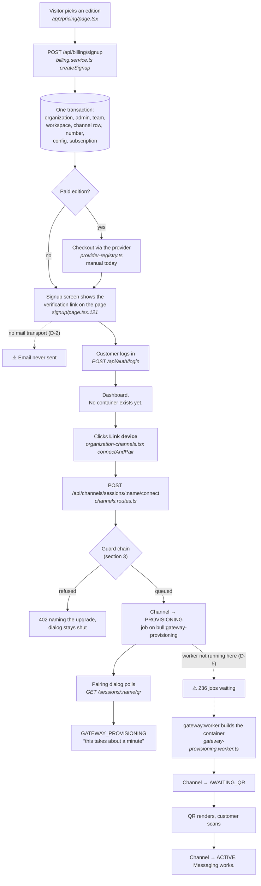
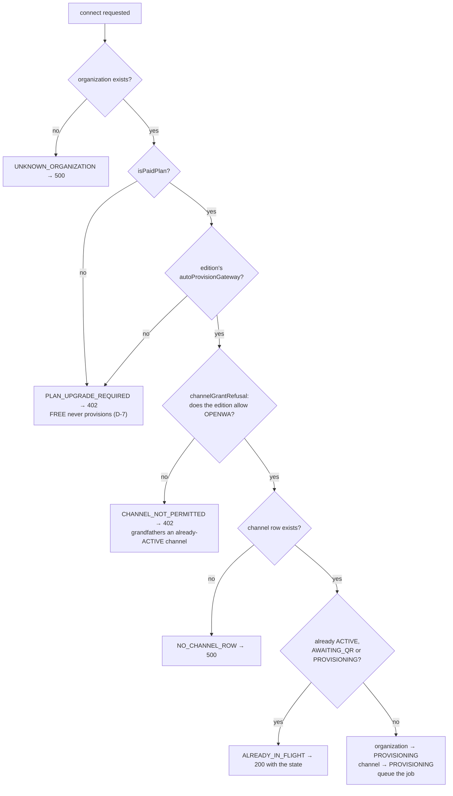
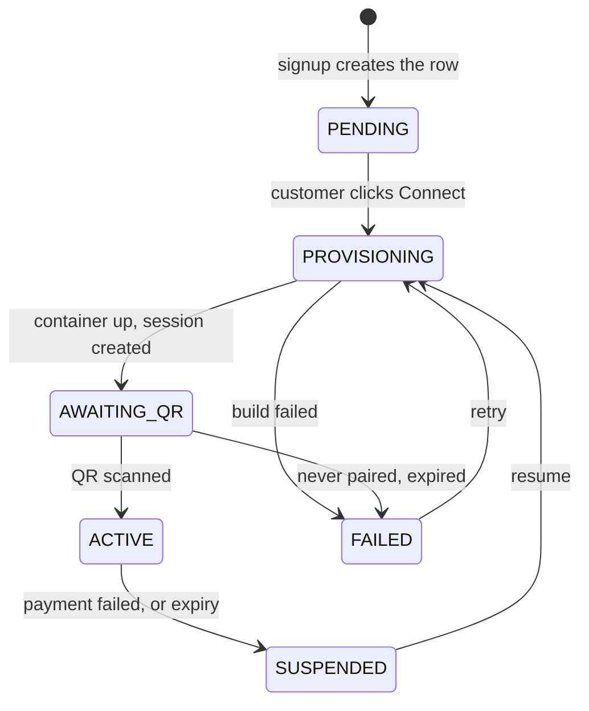
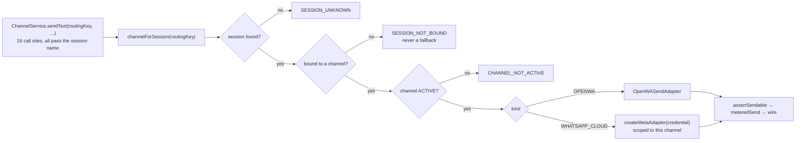
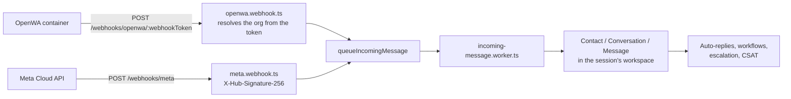

# How RabiTech works, end to end

What actually happens, in the code as it stands at `e5b63b32`. Every box names
the file that does the work, so this can be checked rather than believed.

**Two conventions, because a diagram that mixes them is worse than none:**

- Solid lines and plain boxes are **wired and running**.
- Dashed lines and boxes marked ⚠ are **not wired in this environment** — the
  code exists, the thing that would run it does not. Each names its DECISIONS
  entry.

---

## 1. The customer journey



**The one thing to take from this diagram:** signup creates rows and nothing
else. A workspace costs a row; a container costs RAM for as long as it exists,
so it waits for somebody to ask.

---

## 2. What signup actually creates

One transaction in `createSignup`, in dependency order:

| Row | Note |
|---|---|
| `Organization` | `status: ACTIVE`. Not PENDING — manual activation was removed in `b8755d82`. |
| `Identity` + `User` | The admin. Identity is global (login); User is per organization. |
| `Team` "General" | |
| `Workspace` | The default one, id derived as `ws_<organizationId>` by `defaultWorkspaceData`. |
| `WorkspaceMember` | Mirrors the organization role rather than defaulting. |
| **`OrganizationChannel`** | `kind: OPENWA`, `status: PENDING`, **empty `baseUrl`, empty `apiKeyEnc`**. A row, not a gateway. |
| **`WhatsappSession`** | The first number, **bound to that channel** (`channelId`). Created after it, for that reason. |
| `OrganizationConfig` | Limits copied from the edition by `applyPlanLimits`. |
| `OrganizationBranding`, `WorkingHours`, `OrgSequence` | |
| `Subscription` | `TRIALING` for a trial, else `MANUAL_REVIEW` until a payment event. |
| `EmailVerificationToken` | Consumed by `/api/billing/verify-email`. |

---

## 3. The provisioning guard chain

Every gate a Connect click passes, in order — `maybeProvisionGateway`,
`billing.service.ts`:



Email verification is **not** in this chain, deliberately and transitionally —
D-8 carries the expiry condition.

---

## 4. Gateway lifecycle

`GatewayProvisioningState`, driven by `gateway-provisioning.service.ts`:



**`suspend` stops the container and keeps every volume** — the paired session
survives, so returning does not mean re-scanning a QR. `destroy` is a separate
action that also deletes the organization.

---

## 5. Which gateway a message leaves through

The C1 invariant, `channel.service.ts`:

> An outbound message leaves through the gateway of the session its
> conversation belongs to.



One organization may hold one OpenWA channel **and** one Cloud API channel, both
ACTIVE, with different numbers on each. There is no organization-level "sending
channel" any more; `POST /channels/active` was deleted, not renamed.

---

## 6. Inbound



---

## 7. What an organization is entitled to

`resolveEntitlements`, one resolution order, read at every enforcement site:

```
live override  →  active subscription  →  Organization.tier  →  FREE
```

Overrides are resolved **at read time and never written through**, so expiry
cannot fail and the audit trail cannot disagree with what is enforced.

| Quota | Enforced by | Shown by | Same source? |
|---|---|---|---|
| Metered (6) | `assertMetricAvailable` | `GET /api/usage/current` | yes |
| Seats | `assertSeatAvailable` | `GET /api/usage/seats` | yes |
| Workspaces | `POST /api/workspaces` → 402 | `GET /api/workspaces` | yes |
| **WhatsApp numbers** | **nothing** | nothing | — |

---

## 8. What is not wired

Honest list. Each is recorded, none is a surprise.

| Gap | Consequence | Entry |
|---|---|---|
| No mail transport | Verification, password reset, dunning and suspension notices are logged, never sent. Signup survives only because the link is on screen. | D-2 |
| `gateway:worker` runs nowhere | Jobs queue and nothing consumes them: **236 waiting**. Connect reports "being built" truthfully and the build never starts. | D-5 |
| Cloud API has no connect screen | OpenWA is self-serve; Meta is a form for three values the customer must fetch from Business Manager unaided. Growth sells both. | D-9 |
| `META_APP_SECRET` unset | `editionOfferability` withdraws GROWTH, BUSINESS and ENTERPRISE from sale. Only FREE and STANDARD are sellable. | D-9 |
| No numbers meter | The ladder prices per number; nothing counts them. | — |
| MAC is enforced but should not be priced | `active_contacts` blocks outbound today. The ladder meters seats and numbers instead. | D-3 |
| Plans are not versioned | Editing an edition changes every subscriber's terms silently. 0 invoices so far, so this is cheap to fix now. | — |
| Secrets in public git history | `OPENWA_API_KEY` and the database password, unrotated. | D-4 |

---

## 9. Where the rules live

| Question | One place |
|---|---|
| What is this organization entitled to? | `billing/entitlements.resolver.ts` |
| What does this edition grant? | `billing/editions.service.ts` (cache over the `Plan` table) |
| May this organization obtain this channel? | `channels/channel-entitlement.ts` |
| Can the platform operate this channel at all? | `channels/channel-viability.ts` |
| Which gateway does this number use? | `channels/channel.service.ts` |
| Should a gateway be built? | `billing/billing.service.ts` `maybeProvisionGateway` |
| May this request proceed? | `middleware/access-gate.middleware.ts` |
