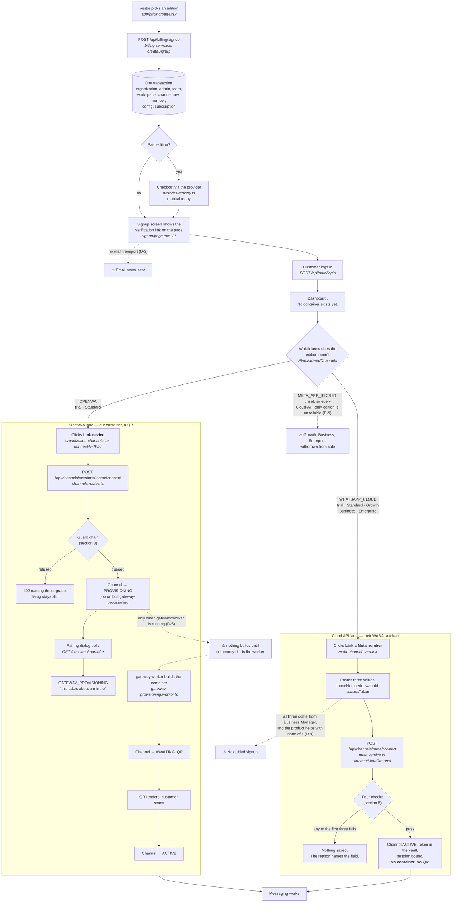
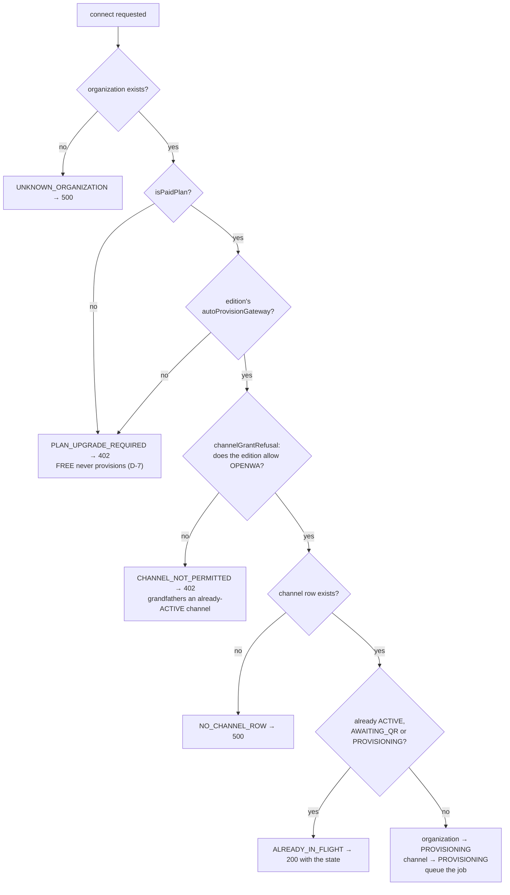
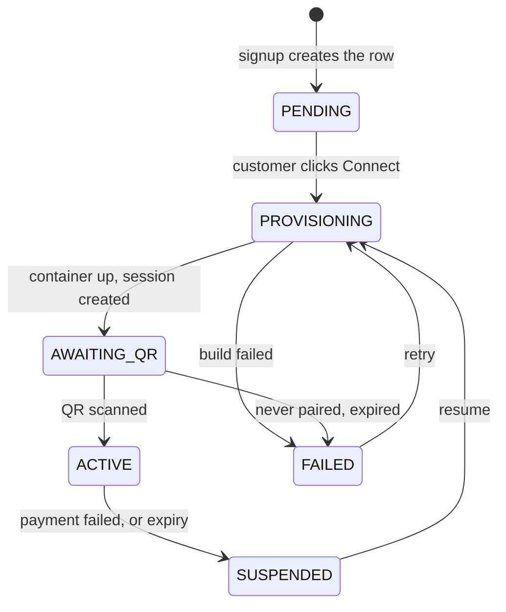
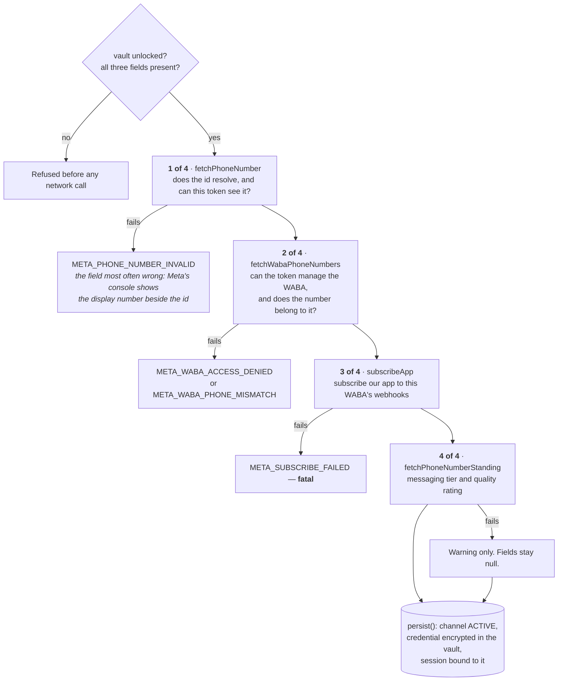
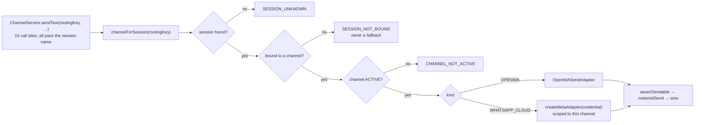
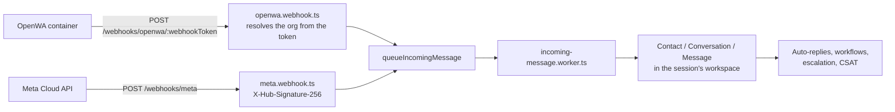

# How RabiTech works, end to end

What actually happens, in the code as it stands at `e5b63b32`. Every box names
the file that does the work, so this can be checked rather than believed.

**Two conventions, because a diagram that mixes them is worse than none:**

- Solid lines and plain boxes are **wired and running**.
- Dashed lines and boxes marked ⚠ are **not wired in this environment** — the
  code exists, the thing that would run it does not. Each names its DECISIONS
  entry.

---

## 1. The customer journey



### Which lanes each edition opens

Not a customer choice — `Plan.allowedChannels`, enforced by
`channelGrantRefusal` at both connect paths. Live values, owner-editable from
the console:

| Edition | OpenWA (QR) | Cloud API (token) | |
|---|---|---|---|
| **Free trial** | yes | yes | **two lanes** — a trial runs on Standard, not on Free |
| **Standard** | yes | yes | **two lanes** — the only edition that sells both |
| **Growth** | — | yes | Meta alone |
| **Business** | — | yes | Meta alone |
| **Enterprise** | — | yes | Meta alone |
| Free (a lapsed trial) | listed | yes | see below |

**Free is listed for OpenWA and can never have one.** `allowedChannels` permits
it, but `autoProvisionGateway` is false, so the guard chain answers
PLAN_UPGRADE_REQUIRED and no container is ever built. Two columns describing one
capability, disagreeing. It is not reachable today — nobody is on Free except a
lapsed trial — but it is a contradiction in the shipped catalogue, not a rule.

**And the two facts above collide.** The Meta-only editions are withdrawn from
sale while `META_APP_SECRET` is unset, so the only sellable paid edition is
Standard — the one edition with two lanes. Of its two, the QR lane needs a
worker that nothing keeps running and the token lane needs a WABA the product does not
help anybody obtain.

**And the other thing to take from the diagram:** signup creates rows and
nothing else. A workspace costs a row; a container costs RAM for as long as it
exists, so it waits for somebody to ask.

---

## 2. What signup actually creates

One transaction in `createSignup`, in dependency order:

| Row | Note |
|---|---|
| `Organization` | `status: ACTIVE`. Not PENDING — manual activation was removed in `b8755d82`. |
| `Identity` + `User` | The admin. Identity is global (login); User is per organization. |
| `Team` "General" | |
| `Workspace` | The default one, id derived as `ws_<organizationId>` by `defaultWorkspaceData`. |
| `WorkspaceMember` | Mirrors the organization role rather than defaulting. |
| **`OrganizationChannel`** | `kind: OPENWA`, `status: PENDING`, **empty `baseUrl`, empty `apiKeyEnc`**. A row, not a gateway. |
| **`WhatsappSession`** | The first number, **bound to that channel** (`channelId`). Created after it, for that reason. |
| `OrganizationConfig` | Limits copied from the edition by `applyPlanLimits`. |
| `OrganizationBranding`, `WorkingHours`, `OrgSequence` | |
| `Subscription` | `TRIALING` for a trial, else `MANUAL_REVIEW` until a payment event. |
| `EmailVerificationToken` | Consumed by `/api/billing/verify-email`. |

---

## 3. The provisioning guard chain

Every gate a Connect click passes, in order — `maybeProvisionGateway`,
`billing.service.ts`:



Email verification is **not** in this chain, deliberately and transitionally —
D-8 carries the expiry condition.

---

## 4. Gateway lifecycle

`GatewayProvisioningState`, driven by `gateway-provisioning.service.ts`:



**`suspend` stops the container and keeps every volume** — the paired session
survives, so returning does not mean re-scanning a QR. `destroy` is a separate
action that also deletes the organization.

---

## 5. Connecting a Cloud API number

No container, no queue, no QR. `connectMetaChannel` in `meta.service.ts` runs
four checks against Meta's Graph API and either saves everything or nothing.



**Step 3 is the one worth understanding.** A valid token routes nothing on its
own — without an active webhook subscription Meta has nowhere to deliver, so the
channel sends fine and never receives. The business experiences that as
customers being ignored, and every screen in this product would show a working
connection. So a failure there aborts the whole connect rather than being saved
as a degraded state.

Step 4 is deliberately non-fatal: by then the token has proven it can read the
number, manage the WABA and subscribe the app, so refusing a demonstrably
working channel because a display banner has nothing to show would be choosing
the label over the thing.

**The channel is ACTIVE the moment those checks pass.** It used to be left
PENDING, because the send path picked the organization's single ACTIVE channel
and a second one made it ambiguous. Routing is per number now, so a Meta channel
being ACTIVE affects no number that is not bound to it — which is exactly what
lets a Standard subscriber run OpenWA on one number and Cloud API on another.

---

## 6. Which gateway a message leaves through

The C1 invariant, `channel.service.ts`:

> An outbound message leaves through the gateway of the session its
> conversation belongs to.



One organization may hold one OpenWA channel **and** one Cloud API channel, both
ACTIVE, with different numbers on each. There is no organization-level "sending
channel" any more; `POST /channels/active` was deleted, not renamed.

---

## 7. Inbound



---

## 8. What an organization is entitled to

`resolveEntitlements`, one resolution order, read at every enforcement site:

```
live override  →  active subscription  →  Organization.tier  →  FREE
```

Overrides are resolved **at read time and never written through**, so expiry
cannot fail and the audit trail cannot disagree with what is enforced.

| Quota | Enforced by | Shown by | Same source? |
|---|---|---|---|
| Metered (6) | `assertMetricAvailable` | `GET /api/usage/current` | yes |
| Seats | `assertSeatAvailable` | `GET /api/usage/seats` | yes |
| Workspaces | `POST /api/workspaces` → 402 | `GET /api/workspaces` | yes |
| **WhatsApp numbers** | **nothing** | nothing | — |

---

## 9. What is not wired

Honest list. Each is recorded, none is a surprise.

| Gap | Consequence | Entry |
|---|---|---|
| No mail transport | Verification, password reset, dunning and suspension notices are logged, never sent. Signup survives only because the link is on screen. | D-2 |
| `gateway:worker` is started by hand or not at all | Nothing in compose or a supervisor runs it. While it is down, Connect reports "being built" truthfully and the build never starts. Run by hand on 2026-09-05 it drained the backlog into **246 failed** jobs for test organizations and produced the first real pairing. | D-5 |
| Cloud API has no *guided* connect | The endpoint and the card work. What is missing is everything before them: Business Manager, business verification, a System User token with `whatsapp_business_management`. A form is not a flow — and it is the **only** lane Growth, Business and Enterprise have. | D-9 |
| Free permits OpenWA and cannot build one | `allowedChannels` says yes, `autoProvisionGateway` says no. Two columns describing one capability, disagreeing. | — |
| `META_APP_SECRET` unset | `editionOfferability` withdraws GROWTH, BUSINESS and ENTERPRISE from sale. Only FREE and STANDARD are sellable. | D-9 |
| No numbers meter | The ladder prices per number; nothing counts them. | — |
| MAC is enforced but should not be priced | `active_contacts` blocks outbound today. The ladder meters seats and numbers instead. | D-3 |
| Plans are not versioned | Editing an edition changes every subscriber's terms silently. 0 invoices so far, so this is cheap to fix now. | — |
| Secrets in public git history | `OPENWA_API_KEY` and the database password, unrotated. | D-4 |

---

## 10. Where the rules live

| Question | One place |
|---|---|
| What is this organization entitled to? | `billing/entitlements.resolver.ts` |
| What does this edition grant? | `billing/editions.service.ts` (cache over the `Plan` table) |
| May this organization obtain this channel? | `channels/channel-entitlement.ts` |
| Can the platform operate this channel at all? | `channels/channel-viability.ts` |
| Which gateway does this number use? | `channels/channel.service.ts` |
| Should a gateway be built? | `billing/billing.service.ts` `maybeProvisionGateway` |
| May this request proceed? | `middleware/access-gate.middleware.ts` |
